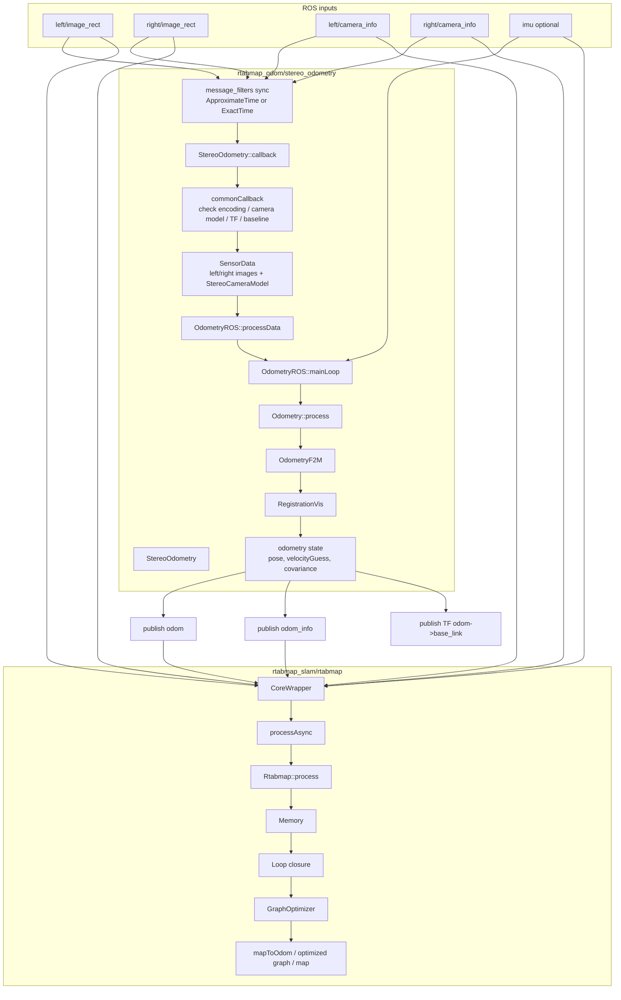

# RTAB-Map Stereo Pipeline Framework

This note describes the code path for the currently discussed RTAB-Map ROS setup:

```text
stereo_odometry
Odom/Strategy = 0 -> OdometryF2M
Reg/Strategy  = 0 -> RegistrationVis
Vis/CorType   = 0 -> Features Matching
rtabmap_slam  -> CoreWrapper -> Rtabmap::process()
```

The focus is on what each module does to images, features and state estimation.

For Mermaid Live Editor drag-and-drop, use these pure Mermaid files:

- `docs/rtabmap_stereo_pipeline_overall.mmd`
- `docs/rtabmap_stereo_pipeline_frontend.mmd`
- `docs/rtabmap_stereo_pipeline_backend.mmd`

## 1. Overall Module Flow



## 2. Frontend: Images, Features And Odometry State

```mermaid
flowchart TD
    A["StereoOdometry::commonCallback"] --> B["Check left/right image size and encoding"]
    B --> C["Get camera->base_link TF<br/>build StereoCameraModel"]
    C --> D{"ImagesAlreadyRectified?"}
    D -->|"false"| E["Initialize rectification maps<br/>rectify left/right"]
    D -->|"true"| F["Use camera_info P/Tx<br/>compute stereo baseline"]
    E --> G["Convert to mono8<br/>or keep bgr8 if keep_color"]
    F --> G
    G --> H["For multi-camera,<br/>stitch left/right images horizontally"]
    H --> I["Build SensorData(left, right, stereoModels)"]

    I --> J["OdometryROS::mainLoop"]
    J --> K["IMU cache/interpolation<br/>optional initial orientation and rotation guess"]
    J --> L["Timestamp checks / rate limit / guess_from_tf"]
    L --> M["Odometry::process(data, guess)"]

    M --> N["Optional rectification / image decimation"]
    N --> O["Build motion guess<br/>velocityGuess / Kalman / IMU"]
    O --> P["OdometryF2M::computeTransform"]

    P --> Q["Current SensorData -> Signature lastFrame"]
    Q --> R{"Does local map have features?"}
    R -->|"No, first frame"| S["Extract current-frame features<br/>initialize local map"]
    R -->|"Yes"| T["RegistrationVis::computeTransformationMod"]

    T --> U["Feature detection<br/>GFTT / ORB / SIFT / etc by parameters"]
    U --> V["Depth mask / floor mask / min-max depth filtering"]
    V --> W["Descriptor extraction"]
    W --> X["3D keypoint generation<br/>stereo disparity or depth projection"]
    X --> Y["Feature matching<br/>VWDictionary / kNN / BF / GMS / SuperGlue optional"]
    Y --> Z["Motion estimation<br/>F2M supports 2D->3D PnP or 3D->3D"]
    Z --> AA["RANSAC / inlier check / covariance"]
    AA --> AB{"Optional local BA?"}
    AB -->|"enabled"| AC["Local bundle adjustment<br/>optimize window poses + 3D points"]
    AB -->|"disabled"| AD["Use registration transform"]
    AC --> AE["Get incremental transform t"]
    AD --> AE

    AE --> AF["Odometry::process post-processing"]
    AF --> AG["3DoF / non-holonomic / particle filter / Kalman filter"]
    AG --> AH["Update velocityGuess"]
    AH --> AI["_pose = _pose * t"]
    AI --> AJ["Publish odom / TF / odom_info"]
    AI --> AK["OdometryF2M updates local map<br/>add new features / remove old points / maintain descriptors"]
```



## 3. Backend: Memory, Loop Closure And Graph Optimization

```mermaid
flowchart TD
    A["CoreWrapper callback"] --> B["Synchronize sensor data + odom + odom_info"]
    B --> C["odomUpdate / odomTFUpdate<br/>get base_link pose in odom frame"]
    C --> D["processAsync"]
    D --> E["CoreWrapper::process"]

    E --> F["Attach async data<br/>global pose / GPS / landmarks / IMU"]
    F --> G["Fix covariance / velocity / external stats"]
    G --> H["Rtabmap::process(data, odomPose, covariance)"]

    H --> I["Validate odomPose<br/>RGBD SLAM mode requires odometry"]
    I --> J["Memory::update"]
    J --> K["Memory::createSignature"]

    K --> L["Uncompress images / scan if needed"]
    L --> M["Rectify stereo/RGBD if needed"]
    M --> N["Optional image decimation"]
    N --> O{"Mem/UseOdomFeatures<br/>and odom_info has valid features?"}
    O -->|"yes"| P["Reuse odometry frontend features"]
    O -->|"no"| Q["Extract keypoints/descriptors again"]
    Q --> R["Depth mask / floor mask / undistort keypoints"]
    P --> S["Create Signature"]
    R --> S

    S --> T["Update VWDictionary<br/>visual words / inverted index"]
    T --> U["STM / WM / LTM memory management"]
    U --> V["Rehearsal<br/>merge very similar neighbor nodes"]
    U --> W["Create neighbor link<br/>odometry constraint"]

    W --> X["Rtabmap::process metric stage"]
    X --> Y["Small displacement / too-fast movement filtering"]
    Y --> Z["Optional refine neighbor link<br/>Memory::computeTransform"]
    Z --> AA["Add optimizedPoses and constraints"]

    AA --> AB["Local loop closure by time/space"]
    AB --> AC["computeLikelihood<br/>current Signature vs Working Memory"]
    AC --> AD["BayesFilter::computePosterior"]
    AD --> AE["Select highest loop hypothesis"]
    AE --> AF["Threshold / epipolar / ratio validation"]

    AF --> AG{"Accepted?"}
    AG -->|"no"| AH["Reject loop closure"]
    AG -->|"yes"| AI["Memory::computeTransform<br/>compute constraint to historical node"]
    AI --> AJ["addLink GlobalClosure/LocalClosure"]

    AJ --> AK["optimizeCurrentMap"]
    AK --> AL["Memory::getMetricConstraints"]
    AL --> AM["GraphOptimizer::optimize<br/>g2o / GTSAM / Ceres depending build/config"]
    AM --> AN["Check max graph optimization error<br/>rollback bad closures if needed"]
    AN --> AO["Update optimizedPoses"]
    AO --> AP["mapCorrection = optimizedPose * rawOdomPose^-1"]
    AP --> AQ["CoreWrapper publishes map->odom TF / map graph / grids / clouds"]
```



## Key Code Entrypoints

- `StereoOdometry::commonCallback`: `rtabmap_ros/rtabmap_odom/src/nodelets/stereo_odometry.cpp`
- `OdometryROS::mainLoop`: `rtabmap_ros/rtabmap_odom/src/OdometryROS.cpp`
- `Odometry::process`: `rtabmap/corelib/src/Odometry.cpp`
- `OdometryF2M::computeTransform`: `rtabmap/corelib/src/odometry/OdometryF2M.cpp`
- `RegistrationVis::computeTransformationImpl`: `rtabmap/corelib/src/RegistrationVis.cpp`
- `CoreWrapper::process`: `rtabmap_ros/rtabmap_slam/src/CoreWrapper.cpp`
- `Rtabmap::process`: `rtabmap/corelib/src/Rtabmap.cpp`
- `Memory::createSignature`: `rtabmap/corelib/src/Memory.cpp`
